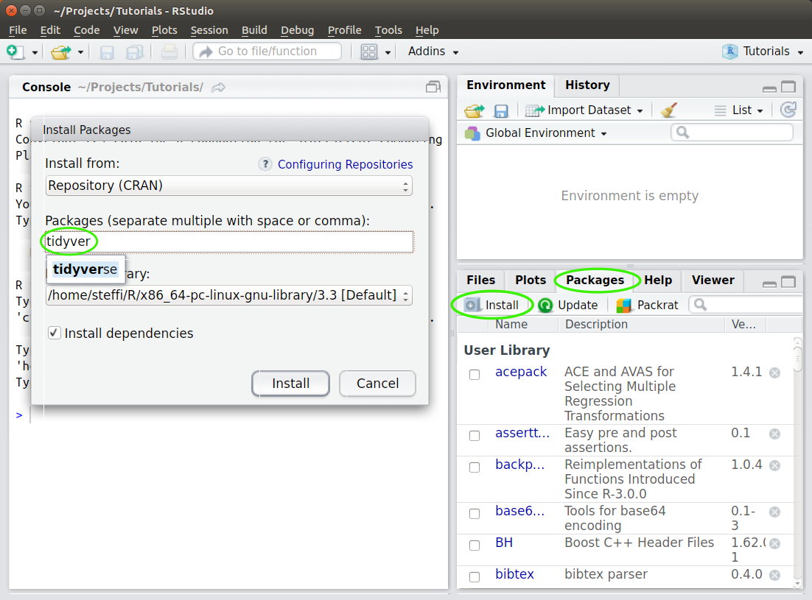

# Workshop: Dealing with Data in R

*An introduction to R for data management and manipulation*

**Instructor**: Steffi LaZerte (<sel@steffilazerte.ca>)<br>
**Location**: Brodie Building Rm 4-47, Brandon University<br>
**Date/time**: Thurs/Fri April 20th-21st 2023, 9am-5pm<br>

To Register contact [Heather Teeple](TeepleH@BrandonU.CA)

> **⚠️Important!⚠️**
>
> Make sure you’re ready for the workshop by following the [**Before the
> workshop**](#before-the-workshop---in-detail) instructions below.
> Please [email me](mailto:sel@steffilazerte.ca) if you run into any
> problems.
>
> Take care to **update both R and RStudio**, in particular.

------------------------------------------------------------------------

Welcome!

Running statistics in R, while difficult, is made even more so by the
challenge of using R to manipulate data. This workshop therefore focuses
on teaching the use of RStudio and the tidyverse suite of packages
(e.g., ggplot2, dplyr, tidyr, etc.) to create figures and data
visualizations, load, clean and summarize data, and generally
troubleshoot R. This workshop is geared towards raw beginners, those
with a basic familiarity with R, and towards intermediate R users
unfamiliar with the tidyverse suite of packages or those wanting to up
their game.

**Each day includes an hour for you to work on your own data, with
support from the instructor to work through your own R problems and
learn how to do analyses specific to your work. Please bring your work
if you would like to take advantage of this.**

This GitHub repository holds all the information relating to our
workshop.

------------------------------------------------------------------------

## Workshop Resources - Slides 🚧 Coming soon! 🚧

These are the slides we’ll use throughout the workshop. Answers to the
activities will be posted after the workshop.

**I recommend using the html version** of these slides as they will be
the most accurate with respect to formatting and will allow you to
easily copy/paste code.

1.  Intro to R
    ([html](https://steffilazerte.ca/workshop-dealing-with-data/1_intro_to_R.html)\|[pdf](https://steffilazerte.ca/workshop-dealing-with-data/pdf/1_intro_to_R_sm.pdf))

2.  Visualizing data in R
    ([html](https://steffilazerte.ca/workshop-dealing-with-data/2_visualizations.html)\|[pdf](https://steffilazerte.ca/workshop-dealing-with-data/pdf/2_visualizations_sm.pdf))

3.  Loading & Cleaning Data in R
    ([html](https://steffilazerte.ca/workshop-dealing-with-data/3_loading_and_cleaning.html)\|[pdf](https://steffilazerte.ca/workshop-dealing-with-data/pdf/3_loading_and_cleaning_sm.pdf))

4.  Summarizing & Transforming Data in R
    ([html](https://steffilazerte.ca/workshop-dealing-with-data/4_summarizing_and_transforming.html)\|[pdf](https://steffilazerte.ca/workshop-dealing-with-data/pdf/4_summarizing_and_transforming_sm.pdf))

5.  Getting help with R
    ([html](https://steffilazerte.ca/workshop-dealing-with-data/5_getting_help.html)\|[pdf](https://steffilazerte.ca/workshop-dealing-with-data/pdf/5_getting_help_sm.pdf))

> Answer slides will be posted after the workshop

------------------------------------------------------------------------

## Before the workshop - In brief

(see [below for details](#before-the-workshop---in-detail))

- Install/Update R

- Install/Update RStudio

- Install R packages for following along

  - `tidyverse`
  - `patchwork`
  - `palmerpenguins`
  - `skimr`
  - `janitor`
  - `readxl`

  To install via R commands:

      install.packages(c("tidyverse", "palmerpenguins", "skimr", "patchwork", "janitor", "readxl"))

- Consider running through the [RStudio Programming Basics
  Primer](https://rstudio.cloud/learn/primers/1.2)

------------------------------------------------------------------------

## Before the workshop - In detail

### **1. Install/Update R**

Even if you already have R installed, **please update it**, so we’re all
working with the same version.

Depending on your operating system, you can install R in one of the
following ways:

Windows

- Go to the Windows download page:
  <https://muug.ca/mirror/cran/bin/windows/base/>
- Download and install R for windows (the link at the top)

Mac

- Go to the Mac OS X download page:
  <https://muug.ca/mirror/cran/bin/macosx/>
- Download and install the version that matches your Mac OS X

Linux: Debian/Ubuntu

- Specific details:
  - Ubuntu <https://muug.ca/mirror/cran/bin/linux/ubuntu/>
  - Debian <https://muug.ca/mirror/cran/bin/linux/debian/>
- Add one of the CRAN repositories to you apt (otherwise your R will be
  out of date)

### **2. Install/Update RStudio**

Even if you already have RStudio installed, **please update it**, so
we’re all working with the same version.

For all Operating systems (i.e., Windows, Mac Os, Linux, etc.) follow
step 2 from RStudio’s download page:
<https://www.rstudio.com/products/rstudio/download/#download>

Open RStudio  **not R**
. RStudio automatically opens R
for you in the ‘Console’ pane

**Verify that your version of R by looking at the first line of the
console (left or lower left pane), you should see something like this:**

    R version 4.2.3 (2023-03-15) -- Shortstop Beagle
    Copyright (C) 2023 The R Foundation for Statistical Computing
    Platform: x86_64-pc-linux-gnu (64-bit)

    R is free software and comes with ABSOLUTELY NO WARRANTY.
    You are welcome to redistribute it under certain conditions.
    Type 'license()' or 'licence()' for distribution details.

      Natural language support but running in an English locale

    R is a collaborative project with many contributors.
    Type 'contributors()' for more information and
    'citation()' on how to cite R or R packages in publications.

    Type 'demo()' for some demos, 'help()' for on-line help, or
    'help.start()' for an HTML browser interface to help.
    Type 'q()' to quit R.

The important line is the first one: R version 4.2.3 (2023-03-15) –
Shortstop Beagle

### **3. Install/Update Packages**

Packages are extensions or add-ons for R. You will use many different
ones over the course of your work with R. `tidyverse` is name of a
collection of newer packages for data management.

We will use the following packages:

- `tidyverse`
- `patchwork`
- `palmerpenguins`
- `skimr`
- `janitor`
- `readxl`

Installing/Updating these packages may take a while (you will see lots
of download text in red in your console). When it’s finished, you should
see a message similar this one to in the console (lower left hand pane)

    * DONE (tidyverse)

    The downloaded source packages are in
        ‘/tmp/RtmpACWq9S/downloaded_packages’
    > 

To install/update via R commands, type the following in the R Console

    install.packages(c("tidyverse", "palmerpenguins", "skimr", "patchwork", "janitor", "readxl"))

Alternatively you can use the RStudio package manager.

- Click on the ‘Packages’ tab in the lower right hand corner
- Click on the ‘Install’ button right below the tab
- Type the name of the package (e.g., ‘tidyverse’) into the ‘Packages’
  box, and click on ‘Install’
- Repeat for the other packages



- Test that your installation had no problems by typing
  `library("tidyverse")` into the console and hitting enter. You should
  see something like this (**Note:** These are messages, not errors!):

``` r
library("tidyverse")
```

    ── Attaching packages ─────────────────────────────────────── tidyverse 1.3.2 ──
    ✔ ggplot2 3.4.1     ✔ purrr   1.0.1
    ✔ tibble  3.2.1     ✔ dplyr   1.1.1
    ✔ tidyr   1.3.0     ✔ stringr 1.5.0
    ✔ readr   2.1.4     ✔ forcats 1.0.0
    ── Conflicts ────────────────────────────────────────── tidyverse_conflicts() ──
    ✖ dplyr::filter() masks stats::filter()
    ✖ dplyr::lag()    masks stats::lag()

> ### Problems?
>
> - If you already had R/RStudio installed, try removing them both and
>   installing everything from scratch
> - If you get an error about a problem installing a specific package,
>   try installing that package invidiually (search for it in the
>   install packages menu)
> - Problems with `tidyverse`? Try installing the packages we need by
>   hand: `dplyr`, `tidyr`, `readr`, `ggplot2`, `lubridate`
> - Email Steffi <sel@steffilazerte.ca>

#### **4. RStudio R primers (optional)**

If you have time, please complete the [RStudio Programming Basics
Primer](https://rstudio.cloud/learn/primers/1.2).

You can complete it online and it’ll give you a quick introduction to R
coding which is will be a great way to get up to speed on the basics
before we jump in.

Feel free to run through other [RStudio
Primers](https://rstudio.cloud/learn/primers).

**Congratulations! Now you’re ready to get into the fun stuff :)**
